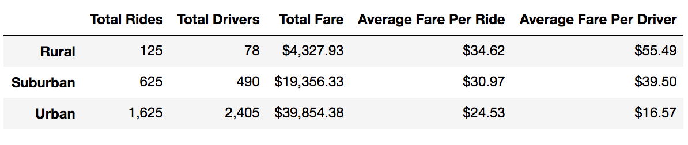
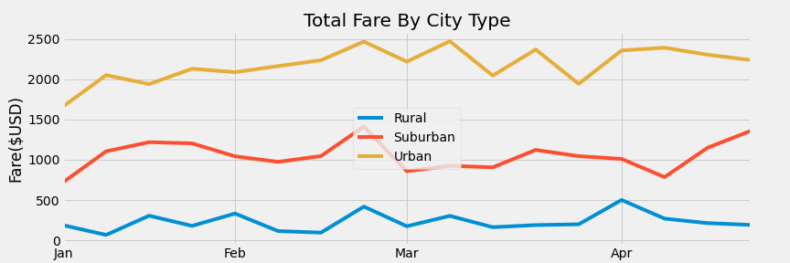

# PyBer Ride Sharing Analysis

## Overview of Project
Create visualization of rideshare data for PyBer to help improve access to ride-sharing services and determine affordability for underserved neighborhoods (i.e.: Urban, Suburban, Rural) with the following tasks to complete.

1.	Calculate the total rides for each city type
2.	Calculate the total drivers for each city type
3.	Calculate the total amount of fares for each city type
4.	Get the average fare per ride for each city type
5.	Get the average driver per ride for each city type
6.	Create multiple line plots that shows the total weekly of the fares for each type of city

## Resources
- Data Sources: city_data.csv and ride_data.csv
- Software: Python 3.7, Matplotlib and Jupyter Notebook

## Results
There is a description of the differences in ride-sharing data among the different city types. The differences are the total rides, the total drivers, the total fares, the average fare per ride, the average fare per driver, the total fare by city type
  

  
## Summary
Based on the results, provide three business recommendations to the CEO for addressing any disparities among the city types
